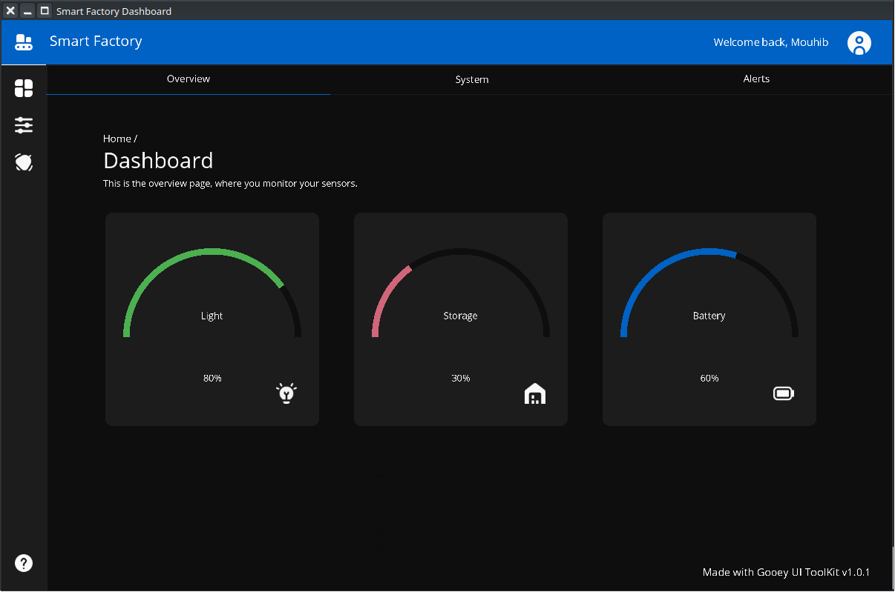

# Gooey - Cross-Platform GUI Library

The elegant way to build cross-platform applications with native performance.





## Warning

For production code disable address sanitizer, it will cause high memory usage.

## Features

- **Cross-Platform**: Write once, build anywhere (Windows, Linux)
- **Lightweight**: Minimal footprint with maximum functionality
- **Customizable**: Tailor every aspect of your UI
- **Minimal Dependencies**: Built with minimal dependencies
- **Pure C**: Portable code perfect for embedded solutions
- **Community Driven**: Open-source under GPL v2 license

## Quick Start

### Installation

Download the latest release from our [GitHub Releases](https://github.com/GooeyUI/GooeyGUI/releases) page.

### Basic Example

```c
#include <Gooey/gooey.h>

int main()
{
    Gooey_Init();
    GooeyWindow *win = GooeyWindow_Create("My Window", 400, 400, true);

    GooeyLabel *label_0 = GooeyLabel_Create("Hello World!", 0.26f, 164, 159);

    GooeyWindow_RegisterWidget(win, label_0);

    GooeyWindow_Run(1, win);
    GooeyWindow_Cleanup(1, win);

    return 0;
}
```

## Documentation

Explore our comprehensive documentation:

- [API Reference](https://gooeyui.github.io/GooeyGUI/website/docs/files.html)
- [Examples Directory](https://github.com/GooeyUI/GooeyGUI/tree/main/examples)
- [Web Builder Tool](https://gooeyui.github.io/GooeyBuilder/)

## Building from Source

1. Clone the repository:
   ```bash
   git clone https://github.com/GooeyUI/GooeyGUI.git GooeyGUI
   cd GooeyGUI
   ```

2. Get Submodules:
	```bash
	git submodule init
	git submodule update --remote --merge
   ```	

4. Build the library:
   ```bash
   cmake -S . -B build
   cd build && make
   # Install if you encounter missing packages
   sudo apt install libdrm-dev libgbm-dev libegl-dev libgl-dev libwayland-dev libxkbcommon-dev mesa-utils
   ```

5. Install (optional):
   ```bash
   sudo make install
   ```
6. Building a example 
   ```bash
   gcc example.c  -o example -L/usr/local/lib/ -lfreetype -lGooeyGUI -lGLPS  -lm -I/usr/local/include/   -fsanitize=address,undefined && ./example
   ```
## Contributing

We welcome contributions!

## License

Gooey is released under the **GNU General Public License v2.0**.

## Community

Join our growing community:

- [GitHub Discussions](https://github.com/GooeyUI/GooeyGUI/discussions)
- [Report Issues](https://github.com/GooeyUI/GooeyGUI/issues)

## Special Thanks

To all our [contributors](https://github.com/GooeyUI/GooeyGUI/graphs/contributors) who help make Gooey better!

---

© 2025 Gooey GUI Library | [Website](https://gooeyui.github.io/GooeyGUI/website/) 
